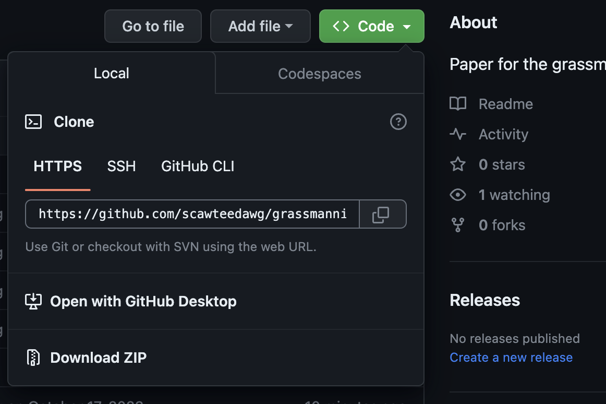

# Grassmannians paper

This is supposed to be an introduction on getting this repository onto your computer, how each of us contributors can see what is changed, and then make updates. 

---
## 1 Clone this onto your computer

In your terminal, go somewhere you would like to copy this repository. Here is an example on my end:

`cd Documents/myFavoriteMathFolder` [^1]

Once you get where you'd like this repository to be saved, click the `<Code>` button to get a link to this repository. 

Finally, in the terminal, type `git clone https://github.com/scawteedawg/grassmannians.git` 

You'll now see all of the files on your computer in a folder 'grassmannians' in the directory you changed to.

--- 
## 2 Adding and changing files

[^1]: (Note `cd` stands for change directory)